# 用户画像
## 1.六个基本标签
>基础特征包括年龄、性别、年代、身高、体重、星座6类标签 
```
年龄:读取业务数据kafka,直接对birthday进行计算获取年龄 

性别:读取业务数据kafka,如果有就直接写入,没有设置为home

年代:读取业务数据kafka,直接对birthday,获取出生日期,直接计算获取年代

身高:读取业务数据kafka,过滤出user_info_sup_msg,与user_info进行关联,获取用户身高

体重:读取业务数据kafka,过滤出user_info_sup_msg,与user_info进行关联,获取用户体重

星座:读取业务数据kafka,直接对birthday,获取出生月份,直接计算获取星座

```
- 流程
  - 1.1 读取业务数据kafka ,下图是原生的flinkCDC业务数据
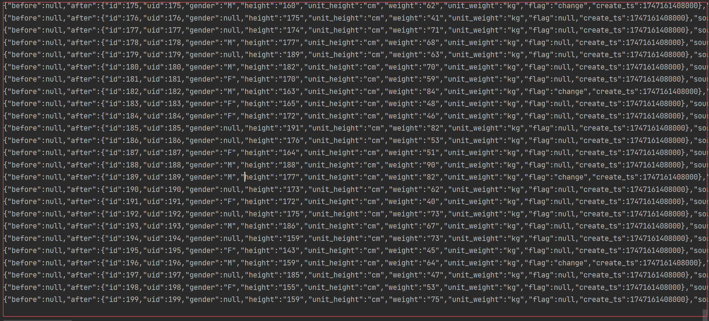
  - 2.2 过滤出user_id表,下图为source中table为user_info的表结构
  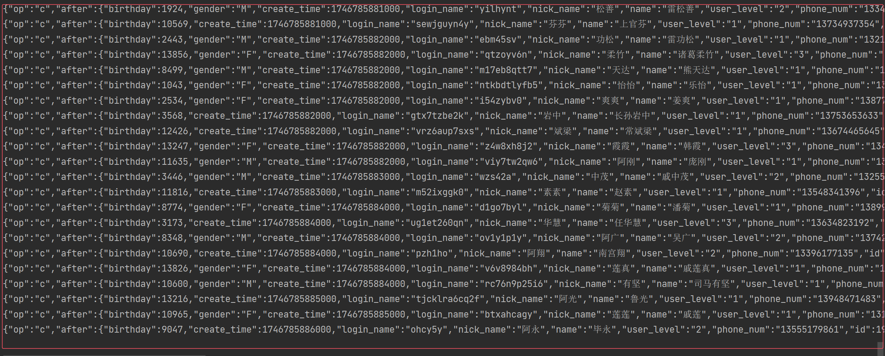
  - 2.3 对过滤出的user_info表,进行map转换,提取after字段到新json中,并转换birthday日期差值转为年月日
  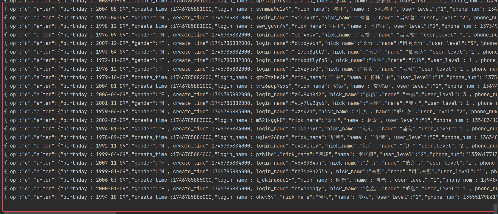
  - 2.4 过滤出user_info_sup_msg,包含用户身高体重数据
  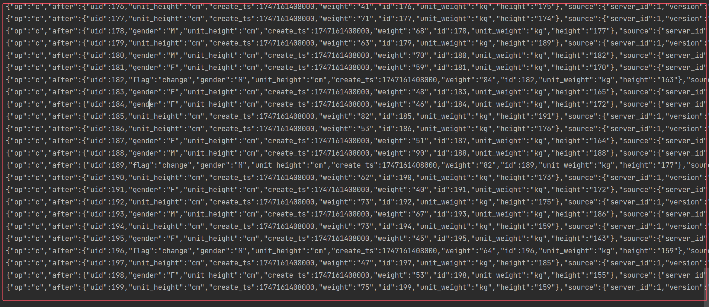
  - 2.5 提取user_info表数据,并使用生日计算出年龄年代星座字段
  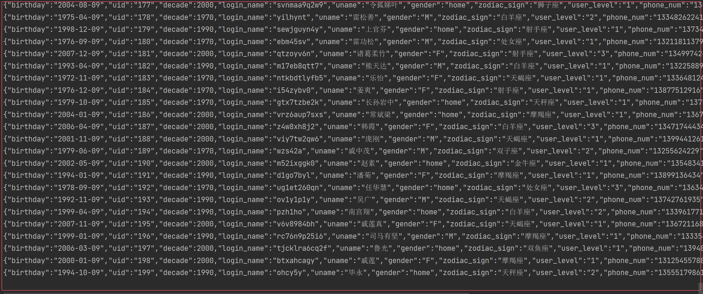
  - 2.6 处理user_info_sup_msg表,提取出需要的字段
  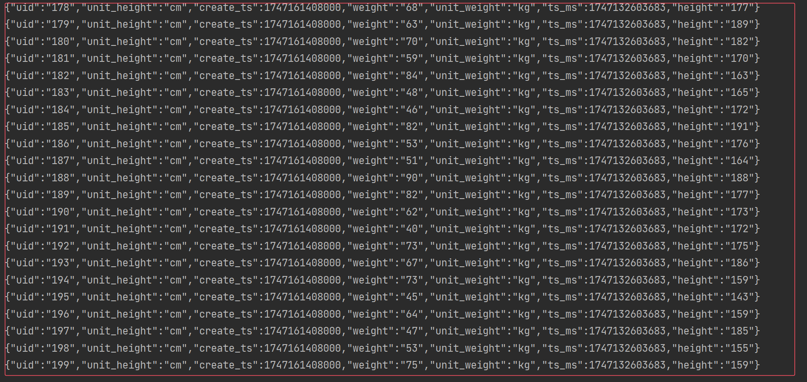
  - 2.7 过滤掉user_info和user_info_sup_msg中uid为空的数据,按uid分组,使用intervalJoin进行join
  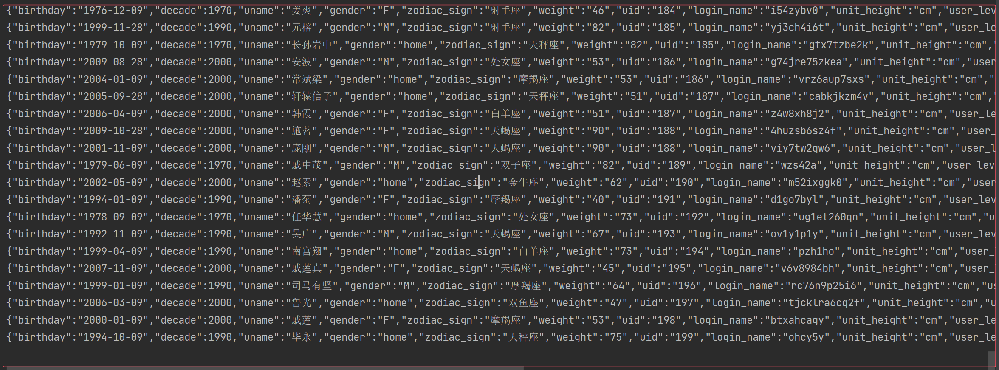
- 2.8 六个基础标签设计完成

## 2.用户购物年龄段标签
- 根据用户在淘宝平台上
  - 浏览
  - 搜索
  - 收藏
  - 加购
  - 购买
- 年龄段分为6类：
   - 18-24岁 
   - 25-29 岁
   - 30-34 岁
   - 35-39岁
   - 40-49岁
   - 50岁以上。
> 1.1 设备和搜索词
- 流程
  - 1.1.1 读取日志数据kafka,获取用户行为日志数据,转为JsonObject类型
  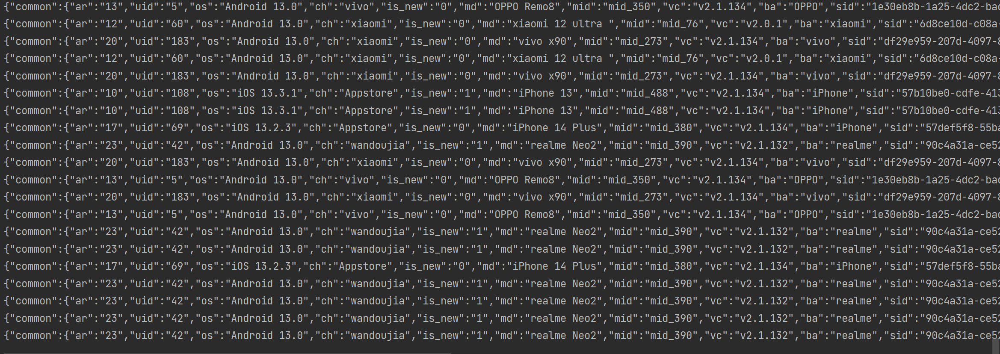
  - 1.1.2 提取出common中的os和page中的item_type字段,
  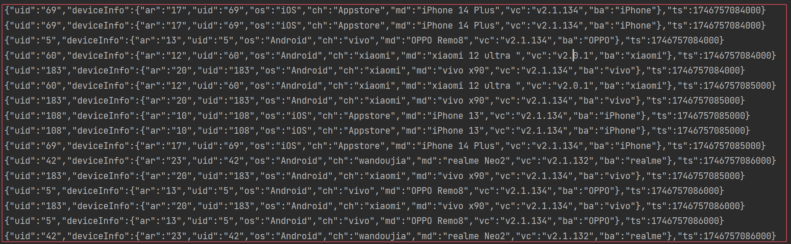
  - 1.1.3 过滤log中uid为空的字段,按uid分组
  - 1.1.4 将每个用户数据进行聚合,每个参数的值都设置为set,每个 2 分钟窗口内的所有数据，最终只保留最后一条
  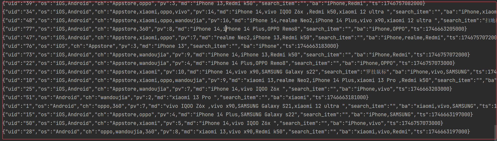
  - 1.1.5 使用jdbc读取mysql,直接获取,搜索词对应的品类,设备的处理为多台设备默认ios,只有安卓为安卓
  - 1.1.6 完成设备和搜索词评分
  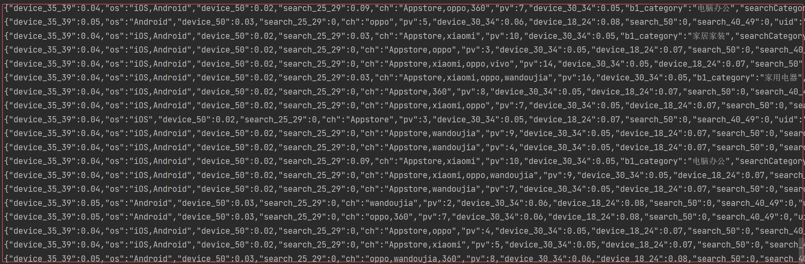


> 1.2 订单品牌,订单类别,订单时间,订单价格
- 流程
  - 1.2.1 读取业务数据kafka,过滤出order_info,order_detail表
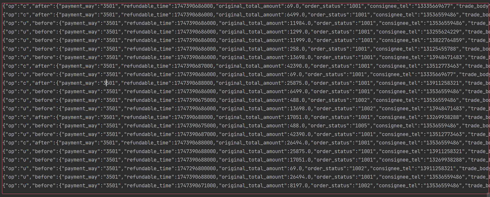
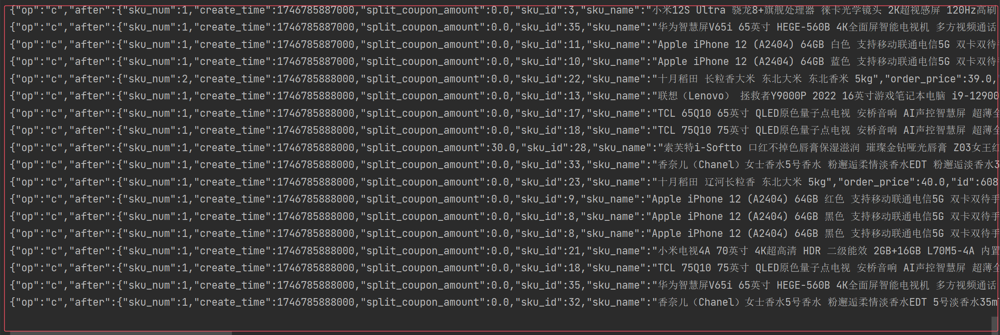
  - 1.2.2 过滤掉order_info中json内容完全相同的的数据
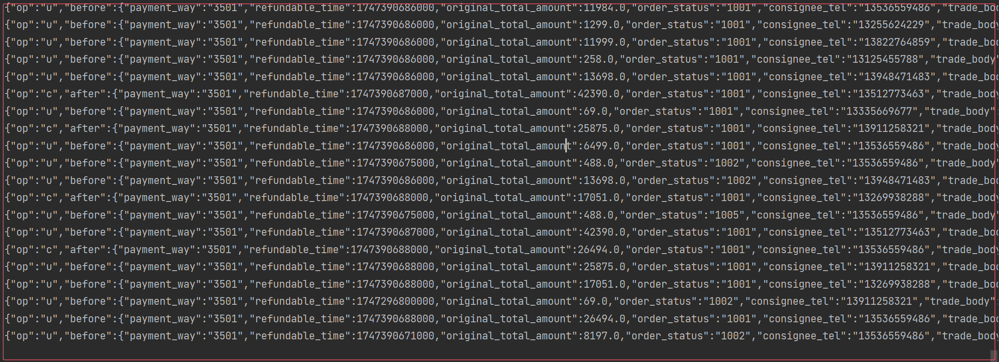
  - 1.2.3 提取order_info中after和ts_ms字段,设置状态算子,取到同一订单号最新的数据,进行去重
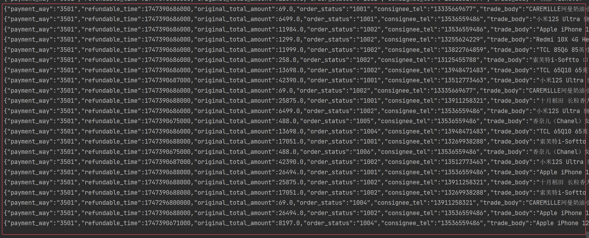
  - 1.2.4 提取order_detail表中的字段order_id,sku_id,order_price,用于join,获取品类和品牌,获取价格区间
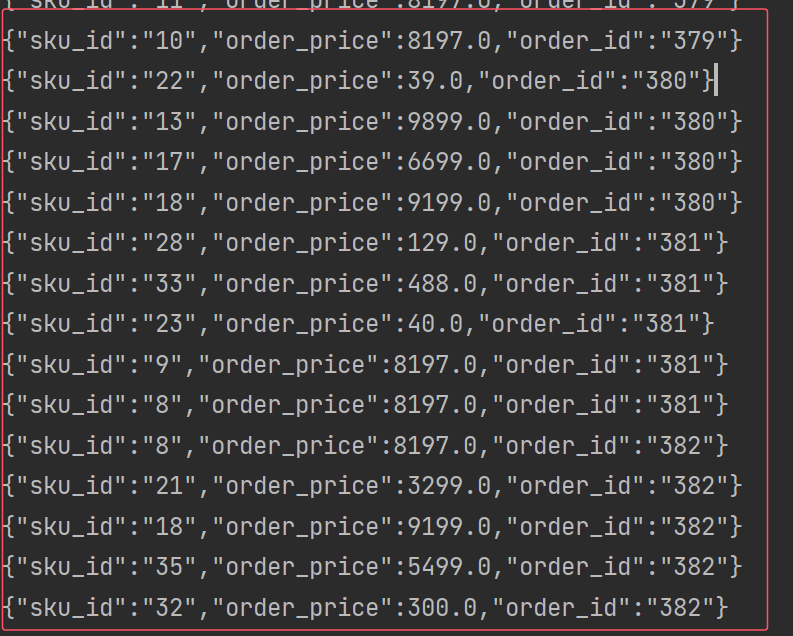
  - 1.2.5 提取order_info表中的id,user_id,create_time,ts_ms字段,用作join,分组,获取订单时间段,水位线

  - 1.2.6 intervalJoin两表,生成订单数据
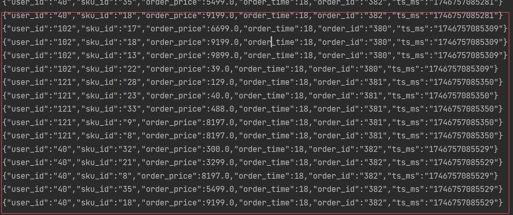
  - 1.2.7 根据sku_id,使用jdbc直接读取mysql,获取到品类和品牌,根据order_price,order_time,获取到订单价格区间和时间区间

  - 1.2.8 进行一个汇总的操作,设置一个mapState,键为价格区间,品牌,品类,时间区间,值为map,map的键为具体分类和出现次数

  - 1.2.9 进行品牌,品类,价格区间,时间区间进行评分
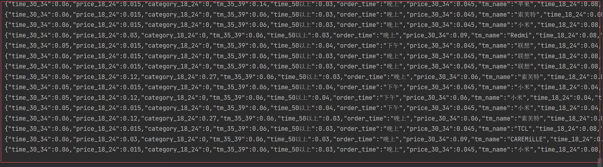
  - 1.2.10 设置基本标签流,设备和搜索词评分流,价格区间和品牌和品类和时间区间评分流的水位线

  - 1.2.11 intervalJoin设备和搜索词评分流,价格区间和品牌和品类和时间区间评分流,累加所有评分,取到评分最大的年龄段

  - 1.2.12 intervalJoin基本标签流,去掉时间戳字段,避免仅仅因为时间戳不同,导致数据重复,对jsonstr进行去重,最终实现用户画像
  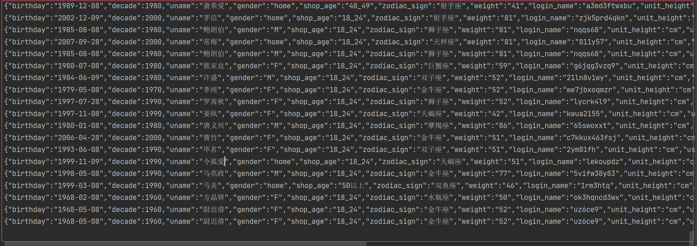
## 3 优化点 
- 1.1 循环代码取代一步一步相加,减少了代码量
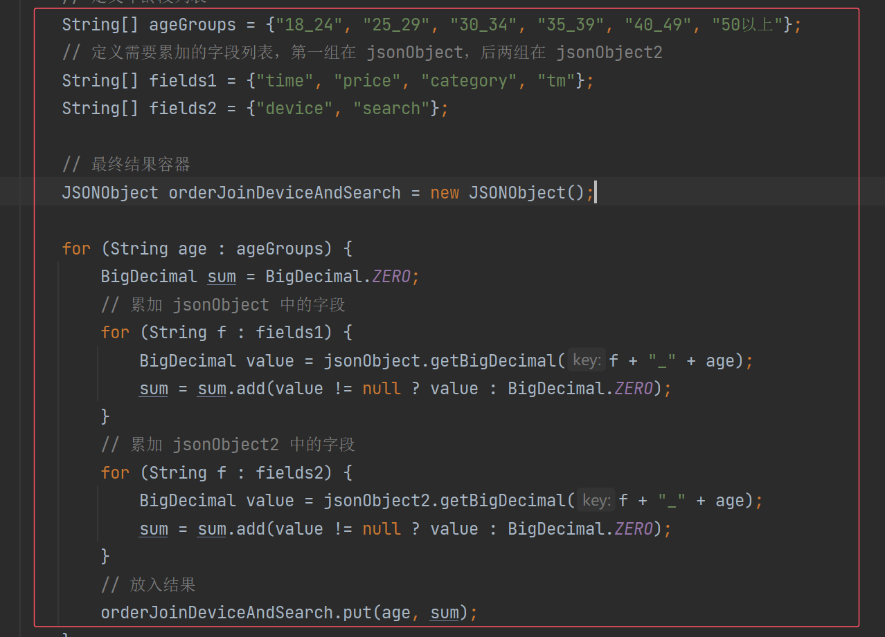
- 1.2 删去时间戳字段,实现去重,避免因为时间戳不同,导致数据重复
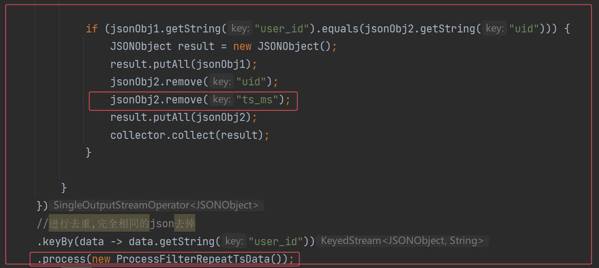
- 1.3 调大idea内存,加快程序运行
  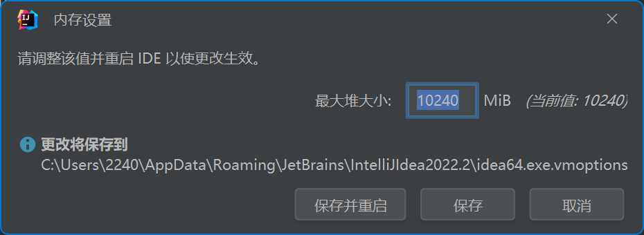

- 1.4 拆分出方法,增强可读性
- 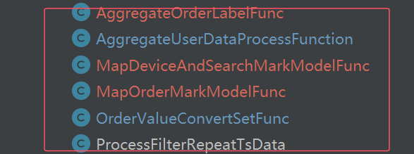
- 1.5 使用jdbc直接读取mysql,加快查询速度
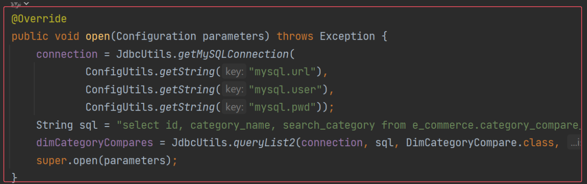
## 4 分层
- 引入kafka实现分层,减小idea运行压力
  - 将六个基本标签,设备和搜索评分,价格区间和品牌和品类和时间区间评分,三个流分别写入kafka
  - 另外写一个类读取kafka,进行join,生成用户画像
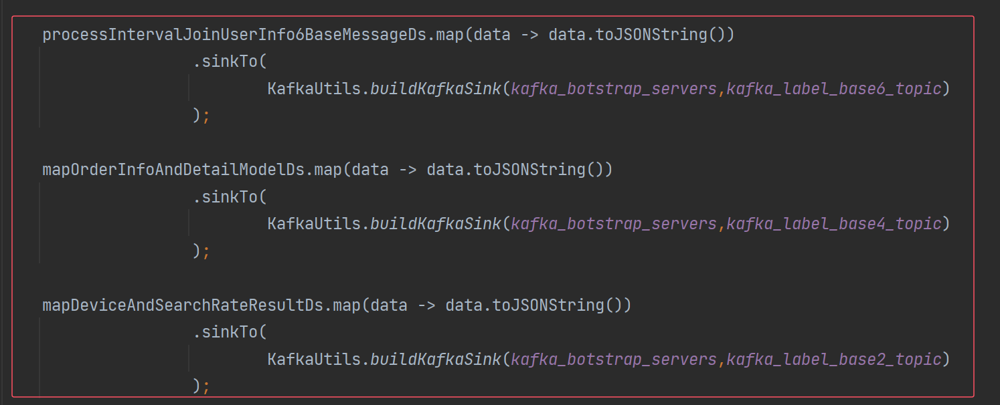
## 5 难点
- 去重
  - 状态算子去重
  - 布隆过滤器去重
- 加权算法实现
- 数据join
  - intervalJoin
  - jdbc

